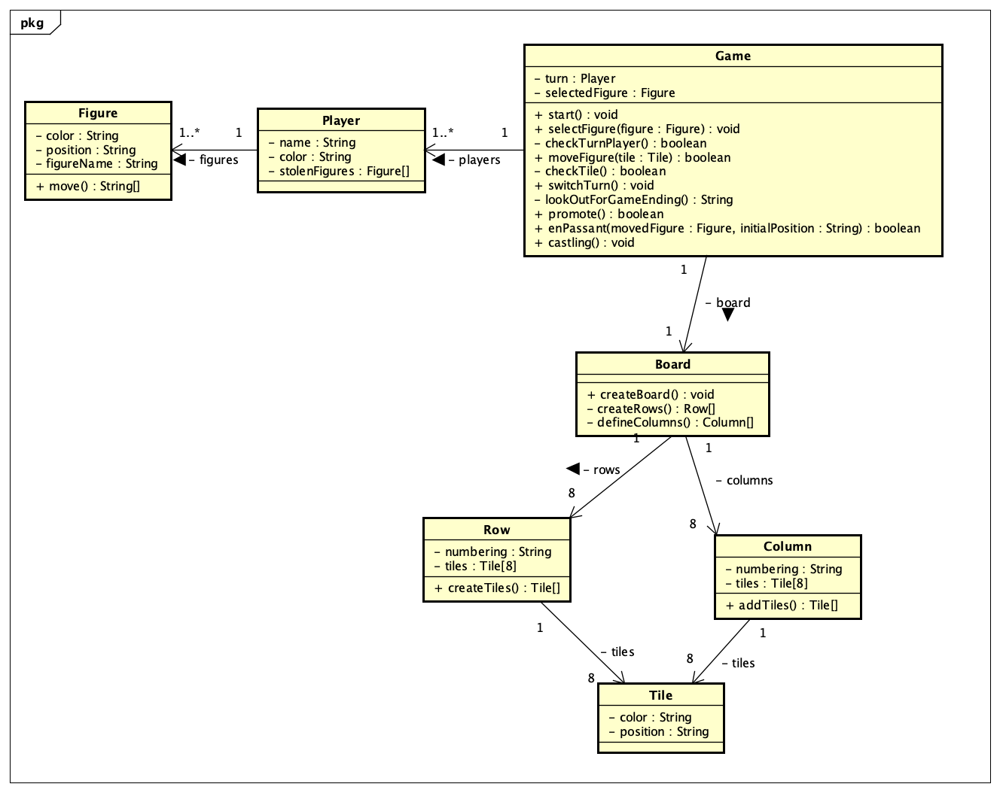
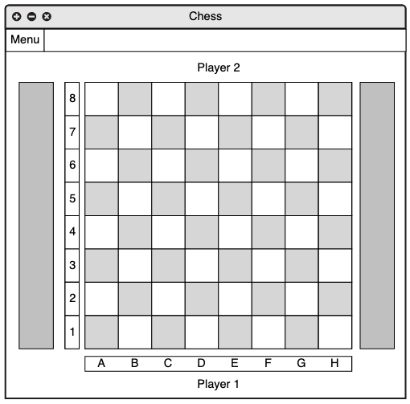
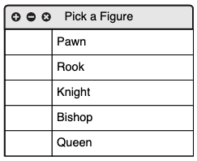

# Chess Game

## Implementation

### UML class diagram

This class diagram is roughly finished. It shows how the game logic is structured. There is no view class or controller class. 

### Mockups 

### General information
- <b>Local</b>: Game is only playable locally
- <b>1v1</b>: Game is playable against a friend
- <b>(1vComputer)</b>: Probably no implementation, but you never know

### Used best practices and conventions
- Use of MVC (Model, View, Controller) framework - Allows the system to be open for modification or usage of single modules elsewhere
- SOLID - Object-oriented-design-principle: 
    - Single-responsibility. Each class / method / attribute has a single-responsibility.
    - Open / closed principle. Open for extensions, closed for modification
    - Liskov substitution principle. Sub classes must have atleast the same functionalities as their super classes.
    - Interface segregation. Classes that implement interfaces should not implement methods which they don't need.
    - Dependency inversion. Changes in sub classes should not lead to changes in super classes
- Common Java naming conventions
- Classes get an introduction comment
- The four main OOP concepts: 
    - Abstraction
    - Encapsulation
    - Polymorphism
    - Inheritance

### Testing
Testing is done with JUnit-Tests. 

### System requirements, How to compile
TODO
### Tools (used for creation)
TODO
#### Licence
TODO

## Game Details
### Introduction
Chess is a famous game for two players. Each player has the <b>same</b> set of figures and all of them have individual movement. The game is played on a 8x8 black/white squared battleground. The goal is to eliminate the other players <u>king</u>. To eliminate a figure put your figure on the space your enemies stand. There are some special rules that will be explained below. 

### Chessboard, Figures and movement
 

Source: https://www.wikihow.com/Sample/Chessboard-Diagram, https://www.wikihow.com/Sample/Chess-Rules, last opened: 17th March 2020

### Rules
- White always starts
- <b>Turn-based</b>: Each player can move one figure within his turn
- <b>Eliminate figure</b>: Get on the same square as your opponents figure
- <b>Check</b>: Each time your figures display a threat to your opponents king it is called check. Your opponent has to move his king away from the threat.
#### Game endings
- <b>Checkmate</b>: If your opponent can't move his king away from the threat, it is called checkmate. With checkmate the game is over and you've won. 
- <b>Draw</b>: If your opponent has only the king left but can't move it because all squares nearby are a threat, it is a draw. 
#### Special
- <b>Promotion</b>: If a Pawn reaches the opposite side of the board, it can be promoted to any piece
- <b>En Passant</b>: If a Pawn's first move of two spaces lands it directly next to an opponent's Pawn, the opponent has the option of capturing the Pawn as it passes. If it chooses to capture, the opposing Pawn advances diagonally as it would have if the first Pawn had initially moved only one space. If the opponent chooses not to capture on the turn immediately after the two-square jump, s/he cannot capture afterward, even if the pawn hasn't moved forward
- <b>Castling</b>: This can be done on the Rook's and the King's first move only. If no other pieces are in between them or could potentially move between them, the King is moved two spaces closer to the Rook. The Rook is then placed on the opposite side of the King. The King cannot be in check or pass through check when performing this move. 

Source: Website https://www.wikihow.com/Play-Chess, last opened: 17th March 2020