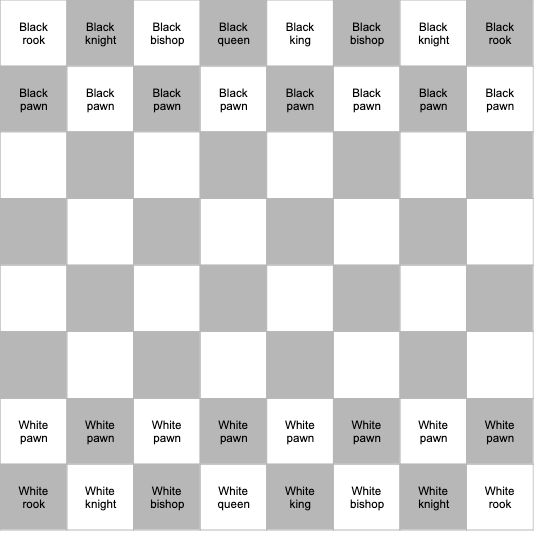
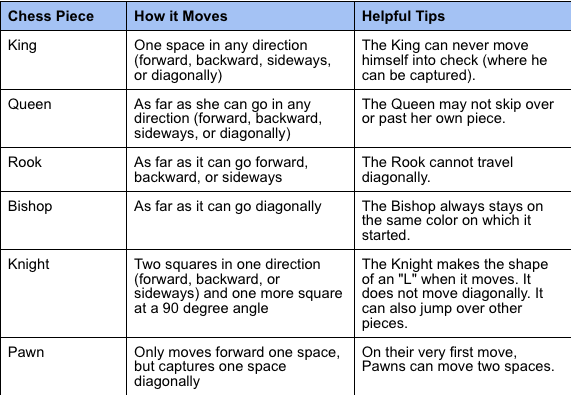

# chess

## Chessboard

Source: https://www.wikihow.com/Sample/Chessboard-Diagram

## Figures and their movement

Source: https://www.wikihow.com/Sample/Chess-Rules

## Rules

#### Who starts
Always the player with the color white starts. 

#### turn-based
The game is turn-based. Each player can move one figure within his turn. 

## Special Rules

#### Promotion 
If a Pawn reaches the opposite side of the board, it can be promoted to any piece

#### En Passant
If a Pawn's first move of two spaces lands it directly next to an opponent's Pawn, the opponent has the option of capturing the Pawn as it passes. If it chooses to capture, the opposing Pawn advances diagonally as it would have if the first Pawn had initially moved only one space. If the opponent chooses not to capture on the turn immediately after the two-square jump, s/he cannot capture afterward, even if the pawn hasn't moved forward

#### Castling
This can be done on the Rook's and the King's first move only. If no other pieces are in between them or could potentially move between them, the King is moved two spaces closer to the Rook. The Rook is then placed on the opposite side of the King. The King cannot be in check or pass through check when performing this move. 

## Win the game

#### check
Each time your figures display a threat to your opponents king it is called check. The opponent has to move his king away from the threat.

#### checkmate
If your opponent can't move his king away from the threat, it is called checkmate. With checkmate the game is over and you've won. 

#### draw
If your opponent has only the king left but can't move it because all squares nearby are a threat, it is a draw. 

## Source
Website: https://www.wikihow.com/Play-Chess

